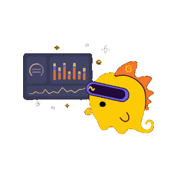

  
  
 
    
    
    Click <strong>Grot</strong> for overview.  
  

---
transition: fade
layout: center
---

 
<strong>Grafana Cloud</strong> gives you insight into the health   and performance of your applications and infrastructure.

 
You can store and visualize data with dashboards,   receive alerts when things go wrong, and much more.

Ultimately, it helps you <strong>reduce downtime</strong>.

   

 Use <kbd>←</kbd> <kbd>→</kbd> or <kbd>space</kbd> to navigate pages. 

---
transition: fade
layout: center
---

 
<strong>Grafana Alloy</strong> is a tool that collects, modifies, and   forwards data to Grafana Cloud (or where ever else).   
Alloy runs on practically everything, including   Linux, Windows, and MacOS.

   

---
transition: fade
layout: center
---

 
<strong>Metrics</strong> are a type of data Alloy collects.   
A metric is a number measured at a specific point in time.   
Metrics give you a sense of how your systems are   performing over time, and spot abnormal patterns.

   

---
transition: fade
layout: center
---

<h3>Lab challenges</h3>

|  |  |
| --- | --- |
| <kbd>1</kbd> | 🤖 Install Alloy on a Linux host |
| <kbd>2</kbd> | 🛠️ Configure Alloy to collect metrics |
| <kbd>3</kbd> | 🔎 Explore metrics in Grafana Cloud |

   

---
transition: fade
layout: center
---

 
Click <strong>Start</strong> in the lower-left corner, once your lab is ready.

